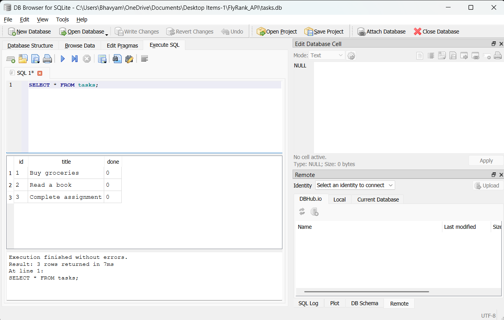

# FlyRank API — BE-02: Connecting to the Database

## Project Overview
This is a CRUD (Create, Read, Update, Delete) Tasks API built with **FastAPI** and **Python**, backed by a persistent **SQLite** database. Data survives server restarts — tasks are stored in a local file, not in memory.

## Why SQLite?
SQLite was chosen because:
- It requires **zero setup** — no separate database server to install or run
- It is built into Python (`import sqlite3`) — no extra packages needed
- It stores all data in a **single file** (`tasks.db`) making it lightweight and portable
- It is perfect for local development and learning database fundamentals

## Where is the Database File?
The database is stored as `tasks.db` in the project root directory.  
It is **automatically created** the first time you run the application — you don't need to do anything manually.

## How to Run the Project

### 1. Install dependencies
```bash
pip install fastapi uvicorn
```

### 2. Start the server
```bash
python -m uvicorn main:app --reload
```

### 3. Open the interactive API docs
Visit: [http://127.0.0.1:8000/docs](http://127.0.0.1:8000/docs)

The database and the `tasks` table are created automatically on first run.  
Three example tasks are seeded only once (when the table is empty).

## API Endpoints

| Method | Endpoint | Description |
|--------|----------|-------------|
| GET | `/tasks` | Get all tasks |
| GET | `/tasks/{id}` | Get a single task by ID |
| POST | `/tasks` | Create a new task |
| PUT | `/tasks/{id}` | Update an existing task |
| DELETE | `/tasks/{id}` | Delete a task |

## Example SQL Queries

Here is a query I ran in DB Browser for SQLite to explore the data:

```sql
-- List all tasks
SELECT * FROM tasks;

-- Show only completed tasks
SELECT * FROM tasks WHERE done = 1;

-- Count total tasks
SELECT COUNT(*) FROM tasks;
```

## Database Screenshot



## Architecture

```
Client (browser / curl)
        │
        ▼
  FastAPI Server (main.py)
        │
        ▼
  SQLite Database (tasks.db)
```

The API layer and the storage layer are completely separate.  
Swapping SQLite for PostgreSQL or MySQL later would require changing only the database code — not the API endpoints.